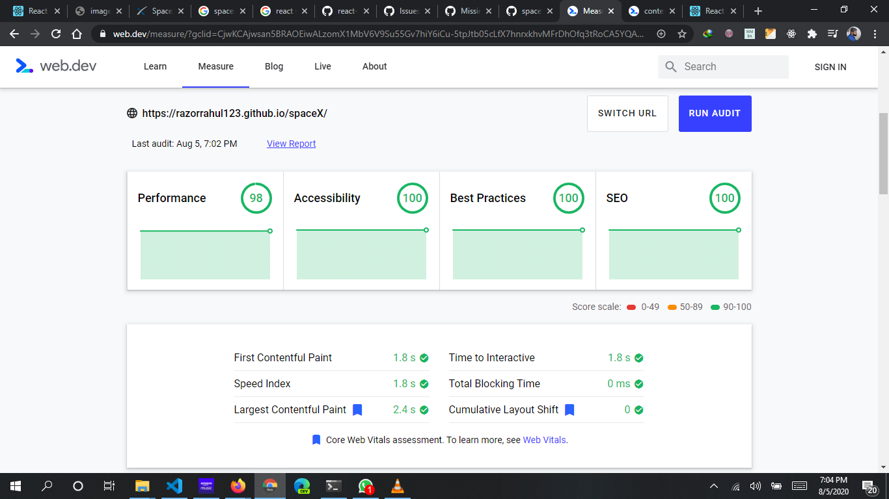

This project was bootstrapped with [Create React App](https://github.com/facebook/create-react-app).

## Project URL

The project is hosted on Github pages and url for the same : [https://razorrahul123.github.io/spaceX/](https://razorrahul123.github.io/spaceX/)
OR
Click here [spaceX](https://razorrahul123.github.io/spaceX/) to open the same

## Available Scripts

In the project directory, you can run:

### `yarn start`

Runs the app in the development mode. 
Open [http://localhost:3000](http://localhost:3000) to view it in the browser.

The page will reload if you make edits. 
You will also see any lint errors in the console.

### `yarn build`

Builds the app for production to the `build` folder. 
It correctly bundles React in production mode and optimizes the build for the best performance.

The build is minified and the filenames include the hashes. 
Your app is ready to be deployed!

See the section about [deployment](https://facebook.github.io/create-react-app/docs/deployment) for more information.

### `yarn install`

This is used to install all the required dependencies

## SpaceX App

The app is build using React JS. Mobile first design appraoch is used for building the app.

The app layout in mobile:

App layout in Tablet:

The desktop layout:

IF the width is greater than 1440px then the content will be centered aligned with max width of 1440px

## LighthouseScore

I managed to get a score of 92 in lighthouse for all the attributes

